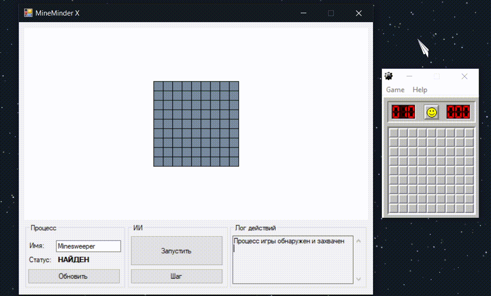

 

   

   <h3 align="center">MineMinder - Minesweeper AI</h3>

   

      Simple AI, that plays Minesweeper from Windows 2000 & XP
   

   <a href="https://github.com/StarPandaBeg/MineMinder/blob/master/README-RU.md">
      🇷🇺 Читать на русском
   </a>

---

  

 

# Features
- Scans the game window and recognizes the current board
- Moves cursor automatically
- Solves simple game situations (to be improved later)

# Getting started
1. Download [latest](https://github.com/StarPandaBeg/MineMinder/releases/latest) release from releases page
2. Download & run Minesweeper game from Windows [2000](https://minesweepergame.com/download/windows-2000-minesweeper.php) / [XP](https://minesweepergame.com/download/windows-xp-minesweeper.php) 
3. Run application, enter game process title (usually *Minesweeper*) in the "Process name" field and click *Update* button
    > The game window should not be minimized.
4. Click "Run AI"

# Contributing

Contributions are what make the open source community such an amazing place to be learn, inspire, and create. Any contributions you make are **greatly appreciated**.

1. Fork the Project
2. Create your Feature Branch
   `git checkout -b feature/feature`
3. Commit your Changes
   `git commit -m 'Add some feature'`
4. Push to the Branch
   `git push origin feature/feature`
5. Open a Pull Request

# License

Distributed under the MIT License.  
See `LICENSE` for more information.